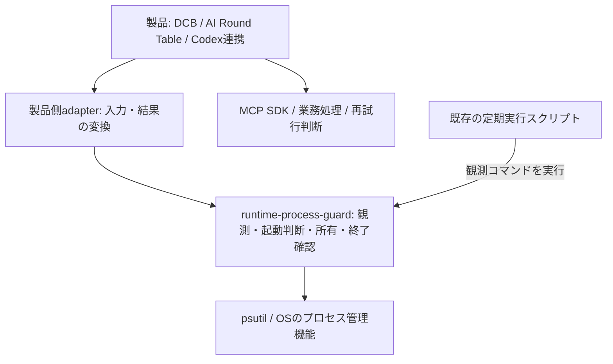

# リポジトリ横断の責務整理・集約設計案

作成日: 2026-09-12 / 状態: 人間レビュー用の設計案。採用・実装・運用適用は未実施。

## 結論

ここで扱うのはソースコードの配置と呼び出し関係である。`runtime-process-guard` はこのリポジトリのPythonライブラリとCLIを指す。「運用側」は定期実行を登録するスクリプト、Codexの設定を書き換えるスクリプト、通知スクリプトの総称であり、新しいシステムではない。

サンドボックスはファイルやネットワークへのアクセスを制限する別機能で、このライブラリへの入力元ではない。supervisorはsystemdなど、プログラムの起動・終了を既に管理する仕組みを指す。その環境では既存の管理者へ終了を依頼し、同じプロセスを二重管理しない。新たな合流先や常駐サービスを作る提案ではない。

判断理由とPR・マージの区切りは [ADR-0002](adr/ADR-0002-process-ownership-and-migration-gates.md) を正本とする。本書は候補と調査根拠を保持する。

`runtime-process-guard` は、**ローカルプロセスの観測、起動可否、起動時からの所有権、終了と残存確認**を正本として持つ。各製品の処理内容、MCPプロトコル、設定配布、通知、スケジュール、クラウド管理、sandboxの実装は集めない。

コードを丸ごと移すのではなく、共通の安全契約と試験を先に固定し、既存実装の適合部分だけを抽出する。標準SDK・OS supervisorで満たせる部分は依存として利用する。

## 今回の範囲と証拠

| 項目 | 内容 |
|---|---|
| project / canonical_repo | runtime-process-guard / nexus-ai-2045/runtime-process-guard |
| mode / closure_rule | search / 現物に基づく候補、境界、採否案、移行手順、未確認事項を返す |
| scope | ローカル横断棚卸し、対象GitHub状態、公開一次資料、設計 |
| excluded | コード移動、依存更新、process起動停止、設定・hook・Scheduled Task変更 |
| goal / done_when | 取り込む単位と残す責務、依存方向、互換性、失敗時動作、検証と移行順がレビュー可能 |
| external_boundary | 読取のみ。push・PR・merge・公開なし |
| return_path | 本書をこのタスクへ返す。実装着手時は最新HEADと各移行元を再照合 |

[事実: gh api user / gh repo view / gh pr list / git status / git worktree list]

- 接続アカウントは `nexus-ai-2045`。対象は PRIVATE、既定ブランチは `baseline`。
- 調査時のremote既定HEAD: `86d2e9a0f7a7f23694774739019e76249a78d64c`。
- 正本ローカルは `codex/lease-registry`、HEAD `1e4920d0a615699ee147b073575f23aeff6a0d18`。既存文書に未コミット変更があるため触れていない。
- PR #7はOPEN、HEAD `fda3dce8c7582780c0e36c05d9d6c5bf31a7f434`。PR #8はMERGED。
- 既定ブランチのtreeとarchitectureをGitHubから確認し、PR #7の同一HEADのローカルworktreeソースを読んだ。ローカル旧ブランチを最新既定の代用にはしていない。
- 既定には admission、collector、privacy、shadow、feedback、lineage、lease分類、plugin window policyがある。永続lease registry、guarded stdio、lifecycle、Windows Job adapterはPR #7側。
- CI・稼働runtime・インストール済みSDKは今回未検証。過去の成功試験や監視ログを現行運用の証明には使わない。

調査はローカルソース検索、同一アカウントのGitHubリポジトリ一覧、MCP・OS公式仕様、GitHub一次実装、2026年研究を対象にした。全repositoryの全branch・全履歴・別マシン・世界中の論文を網羅したものではない。追加候補は同じ採否基準に追記する。

## 責務と依存方向

runtime-process-guardから各製品repoや運用設定repoをimportしない。製品からruntime-process-guardへの依存を一方向にする。共通化のためだけに新しい常駐daemonや万能plugin frameworkを作らない。

| 責務 | 所有先 | 集約判断 |
|---|---|---|
| 匿名snapshot、資源計測、観測完全性 | runtime-process-guard collector | 吸収。OS情報と製品固有の役割判定を分離 |
| 起動可否、budget、保護対象判定 | runtime-process-guard pure policy | 吸収。閾値そのものはcallerの明示policy |
| プロセスidentity、lease、排他・競合検出 | runtime-process-guard | PR #7を土台にし二重実装しない |
| 所有した子・孫の終了とpostflight | runtime-process-guard backend、または既存SDK/supervisor | 所有者は1つ。二重supervisionを避ける |
| one-shot実行のtimeout・出力上限 | runtime-process-guard bounded runner候補 | DCB等の実装とテストから抽出 |
| MCP接続、request取消、能力交渉、再接続 | MCP client / SDK | 吸収しない。必要ならactivity情報のみ受け取る |
| prompt、モデル選択、quota、業務の再試行 | 各製品 | 吸収しない。停止成功は業務の再実行許可ではない |
| plugin manifest編集、Codex配線、インストール | 製品設定adapter | coreから分離。既存入口は互換wrapperとして維持 |
| 定期起動、通知、音声、運用dashboard | 運用repo | receiptを読む。runtime-process-guardは通知先や認証を持たない |
| Git worktree削除判定・WIP保護 | worktree-lifecycle-control | 別正本。必要なら活動中processの証拠のみ利用 |
| モデル配置・GPUサービス・同期・クラウド | 各専門repo | 一般subprocess機構だけ利用、運用責務は残す |
| 悪意あるコードのFS/network隔離 | 専用sandbox | Job/process管理だけでsandbox安全性を主張しない |

## 現物を確認した移行候補台帳

Projects配下はローカル探索で確認した候補であり、別ownerのremoteからの情報集約・コード移管を承認済みとは扱わない。パスは各repo相対。移行元の最新remote一致は実装前に確認する。

| 移行元 / 根拠 | 移す部分 | 残す部分・互換性 | 優先 |
|---|---|---|---|
| Projects `shared/scripts/runtime_process_doctor.py:150,220,237,352,575,700` | 汎用モデル、観測、秘匿化 | Codex/Claude/Chrome分類、推奨はadapter | P1 |
| Projects `shared/scripts/node_process_tree.py:21,28,51` | doctorと重複する採取・秘匿化 | 既存CLIを共通observerのwrapperにする | P1 |
| Projects `shared/scripts/agent_process_snapshot.py:26,73,143,237,255` | Windows/POSIX観測 | `kind`語彙は`ops_fact_snapshot.py`とテストに互換維持 | P1 |
| Projects `shared/scripts/runtime_process_watch.py:82,116,128,172` | 軽量psutil採取、閾値評価 | 頻度、保存先、通知、doctor呼出しは運用側 | P1 |
| Projects `shared/scripts/memory_watch.ps1:71,94,128` | 観測とPID+生成時刻の連続証拠 | scheduler用入口を維持 | P2 |
| 同 `memory_watch.ps1:165` | 取り込まない | 古さ等によるAutoClean強制停止は旧方式廃止候補。有効状態未確認 | P0調査 |
| Projects `shared/scripts/codex_mcp_duplicate_guard.py:111,172,236` | 必要なら匿名観測だけ | Codex固有候補判定を残す。PID集合再照合だけを汎用停止許可にしない | P2 |
| Projects `shared/scripts/process_watchdog.py:80,104,192,210,234,350,598,684` | macOS観測interface | Gatekeeper診断、通知、launchd生成は運用側 | P2 |
| AI Round Table ローカル`ai-roundtable`の`roundtable/relay_process.py:18` | Job/session管理をmanaged spawnへ置換 | 席protocol、モデル、再試行は元repo。現行adopt/best-effort/taskkill fallbackを複製しない | P1 |
| discord-context-bridge `src/discord_context_bridge/process_runner.py:64,76,96,126,157` | timeout、64KiB出力上限、bounded runner | `ProcessResult`とDCB固有の環境制限を維持 | P1 |
| discord-context-bridge `scripts/discord_route_retry_decider.py:33` | runner重複をDCB標準へ先に統合 | route選択・再試行判断はDCB内に残す | P1 |

既存の移管台帳 `Projects/shared/config/windows_process_doctor_retirement_manifest.json:11` と検査器 `shared/scripts/windows_process_doctor_retirement_gate.py:76` がある。旧windows-process-doctor→Projectsへの来歴を引き継ぎ、本書で第三の診断正本を作らない。

既存保証 `shared/scripts/codex_process_doctor_guarantee.py:67` と `shared/scripts/runtime_process_watch_contract_check.py:81` は移行検証候補。今回実行したという意味ではない。

隣接repoの現物確認: worktree-lifecycle-controlはGitのcloseoutを保持し汎用runnerのconsumer候補。nexus-management-osは正規化結果を受けるconsumer候補。local-ai-foundationでは今回の検索から移管十分な実装を特定できなかった。nexus-plugin-orchestrator、windows-codex-setup-kit、syncthing-sync-opsはGitHub一覧では確認したが指定ローカル範囲に見つからず、設定writerの移管先を確定する根拠にはしない。

## 既存契約を明確化する設計上の論点

1. **shadowの意味を分離する。** PR #7 `guarded_stdio.py:162`以降はadmissionで起動を拒否し得るうえ、自身で子を起動してJobに入れる。EOF後の回収もある。したがってread-onlyではない。新設計は `observe`（観測のみ）、`managed`（承認済み起動と終了管理）、`idle-enforce`（追加のidle終了）を別能力として示す。旧`shadow`を新しい強い意味へ暗黙変換しない。
2. **identityは所有権ではない。** `privacy.py`はsecretを除外し実行ファイルをbasename化してhash化する。別資格情報・別パスの実行も同一候補になり得る。観測用fingerprintと、所有ハンドル・起動世代・caller scopeを分離する。hashだけでreuse、終了、認可を決めない。
3. **lease回収とprocess終了を別にする。** `safe_to_reclaim`は期限切れ記録の整理判断であって、任意PIDの停止許可ではない。owner不明、観測欠落、生存ownerの期限切れは停止に進めない。
4. **観測の欠落を明示する。** 現行`Observation`にはinaccessible件数があるが、`evaluate`はcollection_errorsと同じ扱いにしていない。必要な所有権観測が不完全なら`unknown`。ホスト全体で無関係processが見えないだけの場合と分け、無差別に全起動を止める設計にも寄せない。
5. **check-then-launch競合を閉じる。** read-only preflightは助言であり排他予約ではない。singletonはscope単位、共有budgetはbudget pool単位の排他として別に定義する。異なるscopeでも同じpoolを消費するなら判定と予約を直列化し、未確定予約を使用量に含める。起動成功時は予約を実使用へ置換し二重計上せず、起動失敗時は所有権を照合して解除する。owner不明の予約は自動解放せずunknownとして残す。これは参加するlauncher間の約束であり、管理外processのホスト資源消費まで保証しない。hard limitが必要ならOS境界を利用する。初期版で予約を実装しない場合は助言のみと明示する。
6. **idleを通信量から決めない。** PR #7のenforce拒否を維持する。MCP SDK/callerから確実な活動状態が得られない場合はidle終了を提供しない。JSON-RPC parserを独自に増設することを前提にしない。
7. **Windows生成競合。** PR #7はsuspended生成→Job割当→resume。割当前にguardがクラッシュする窓は残る。作成時Job割当を優先調査し、未対応backendでは保証差を返す。

## 共通APIの案

既存CLIの終了コード `0/10/20/30/40` は互換を保つ。新APIは最初はPython内の小さな型と関数に限定する。以下は未実装の案。

| 型・操作 | 契約 |
|---|---|
| `ProcessObservation` | 取得時刻、scope、PID+creation time、観測完全性、匿名集計。ログ用と制御用の値を分離 |
| `LaunchSpec` | argv配列、作業場所、環境はメモリ内のみ。transport、scope、budgetを明示。shell文字列は既定拒否 |
| `evaluate(observation, policy)` | pure functionで既存判断語彙を返す。副作用なし |
| `launch(spec) -> OwnedProcess` | 自分で起動した境界のhandleを返す。任意PIDのadoptを提供しない |
| `shutdown(handle, deadline)` | graceful→bounded wait→所有境界だけ終了→残存確認。単調時計で期限管理 |
| `run_bounded(spec)` | one-shot用。timeoutとstdout/stderr上限、drainとbackpressureを定義 |
| `CleanupReceipt` | schema_version、匿名scope、reason、backend能力、cleanup状態、残存数、所要時間。raw argv/env/出力本文なし |

`run_bounded`の出力は製品側へメモリ内で返す場合と、匿名運用receiptを分ける。勝手に永続化しない。stdioはbyte透過を維持し、one-shot用の出力切詰めをMCP stdoutへ適用しない。上限超過は黙って欠損させず明示失敗へ落とす。

状態遷移は `requested → reserved → started-owned → stopping → verified-exited`。各段階の失敗は `unknown / cleanup-failed`として残す。lease解除は消滅確認後。process終了成功と業務成功を別フィールドで返す。caller取消中でもcleanupを短い上限付きで完遂し、cleanup失敗を元のエラーから消さない。

backend能力は `observe / own-child / own-tree / hard-resource-limit`を別々に返す。Windows Job、Linux専用cgroup、macOS process groupを同等保証と表示しない。groupから離脱できる環境で「全子孫終了保証」を出さない。

## 外部の先行実装・研究と採否

以下は2026-09-12に確認した公開一次資料。main/latestは変動参照であり、導入時にrelease・commit・licenseを固定する。ローカルへの導入済みを意味しない。

| 出典 | 設計に取り入れること | 境界・保留 |
|---|---|---|
| [MCP stdio 2026-07-28](https://modelcontextprotocol.io/specification/2026-07-28/basic/transports/stdio) | EOFから期限付き終了、stdoutのプロトコル専用性 | request取消とprocess終了を分離。旧仕様との互換はclientに残す |
| [MCP Python SDK main](https://github.com/modelcontextprotocol/python-sdk/blob/main/src/mcp/client/stdio.py) | cancellation中のcleanup、drain、tree終了を既存SDKと重複照合 | release収録・導入版は未確認。SDKを使えない一般CLIには別adapterが必要 |
| [Microsoft Job Objects](https://learn.microsoft.com/en-us/windows/win32/procthread/job-objects) | 所有Jobの終了・会計を利用 | nested job/breakawayなどの能力差を検証 |
| [Microsoft 作成時Job割当、2023-02-09](https://devblogs.microsoft.com/oldnewthing/20230209-00/?p=107812) | `PROC_THREAD_ATTRIBUTE_JOB_LIST`で割当前クラッシュ窓を閉じる案 | 対応WindowsとPython bindingを実装前に検証 |
| [Linux pidfd_open](https://man7.org/linux/man-pages/man2/pidfd_open.2.html) | PID再利用に強いhandle | spawnとの競合、tree管理は別問題 |
| [Linux cgroup v2](https://www.kernel.org/doc/html/latest/admin-guide/cgroup-v2.html) | 専用境界での資源制限と子孫終了 | delegation必須。ホスト全体のgroupを流用しない |
| [systemd kill契約](https://github.com/systemd/systemd/blob/main/man/systemd.kill.xml) | 既存unitの停止契約を利用 | unit所有者とruntime-process-guardで二重管理しない |
| [Tini](https://github.com/krallin/tini) | コンテナ内reapとsignal転送を再利用 | 資源制限や完全なtree隔離の代用ではない |
| [sandbox-runtime](https://github.com/anthropics/sandbox-runtime) | sandboxを別責務として連携 | 機能・OS成熟度を固定版で確認。今回導入しない |
| [Sandlock、2026-05-25 preprint](https://arxiv.org/abs/2605.26298) | kernel側の制限と狭いsupervisorの分離を参考にする | Linux研究。成熟依存として即採用しない |
| [AI Sandboxes、2026-06-16 preprint](https://arxiv.org/abs/2606.18532) | 制御・観測・証拠と保証の対応を参考にする | 広いsandbox評価研究でありprocess libraryの直接実装根拠にはしない |

## 移行順序と完了条件

| 段階 | 作業・owner | 完了条件 | 復帰方法 |
|---|---|---|---|
| 0 | 本線: 候補台帳と境界をレビュー | 移行元、callers、license、owner、現行HEADが特定できる | 本書の設計案へ戻る |
| 1 | runtime-process-guard: PR #7との差分・SDK重複・mode契約を整理 | 新しい機能を重複作成せず、必要差分と未保証が明確 | PR #7と新設計を分けて保持。mergeは別判断 |
| 2 | runtime-process-guard＋共有診断owner: collectorとpure policyを抽出 | 旧CLI形式・終了コード・観測結果の互換、privacy試験 | 元の入口を残し依存を以前の固定版へ戻す |
| 3 | runtime-process-guard＋DCB/AI Round Table owner: bounded runnerとbackend統合 | 子・孫終了、timeout、取消、上限の共通契約試験合格 | caller単位で旧版へ戻せる。状態schemaの逆互換を事前確認 |
| 4 | 製品owner: 1 callerずつ依存切替 | 業務の結果・エラー分類・終了コードが維持される | 1 callerのみ切戻し。全repo同時切替しない |
| 5 | 運用owner＋人間: 限定runtime pilot | 設定差分レビュー、非所有process無傷、残存確認、失敗receipt | 承認済み設定差分を戻す。広域killを復旧手段にしない |
| 6 | 各移行元owner: 旧実装廃止 | 参照0、互換期間終了、旧scheduled経路も確認 | 削除は別承認。取り込み成功だけでは削除しない |

最初の実装単位は「PR #7を前提にした契約整理と、観測側の小さな抽出」。plugin設定writerの他repo移動や全OS同時実装を先行させない。Python packageは承認済みの配布経路でversion/commit固定し、他repoの絶対パスimport・editable install前提を廃止する案とする。配布先の新設や認証設定は今回行わない。

## 検証設計

pure policyは実process不要。backendは専用の無害な子・孫fixtureだけで試験する。既存アプリを試験対象として停止しない。

- PID再利用、owner不明、期限切れowner生存、観測欠落では非所有processへ作用しない。
- 並行起動、lease lock競合、破損state、heartbeat遅延、時計の逆行で誤起動・誤回収しない。
- spawn途中のguard終了、Job割当失敗、nested job、孫残存、caller取消、EOF、pipe飽和を試験する。
- timeout・出力上限・cleanup失敗を製品例外へ正しく写像し、業務requestを自動再送しない。
- argv、env、例外文字列、stderr、MCP本文に疑似secretを入れ、receipt/stateへ残らないことを確認する。
- OS別に未対応能力を`unknown/unsupported`で返す。Windows成功をmacOS/Linux保証へ転用しない。
- pilotは既存PROCESS_LIFECYCLE_DECISION.mdの期間・回数・誤停止ゼロ条件を出発点に人間レビューする。少数標本のP99を強い保証とせず、観測数と最大値も併記する。

## 取りこぼしを減らす運用案

実装段階の候補台帳には `source_repo / source_path / source_sha / responsibility / decision / target / callers / tests / owner / status`を持たせる。今回の候補表を起点に、既存repository一覧・call site検索から増分で更新する。

移行後は候補の `subprocess` / `Popen` / `Stop-Process` / `taskkill` / Job API使用を差分検査し、新しい直接実装をレビューへ返す。ただし直接使用を一律禁止せず、SDK所有・専用サービス・fixture等の理由付き例外を残す。検査器は既存CIへ組み込み、監視daemonは増やさない。

## 残務と再開条件

| 残務 | owner | 次の行動・再開条件 |
|---|---|---|
| 各移行元の最新remote/WIP/callers照合 | 実装担当 | 実装対象を選んだ時点で再測定 |
| 別ownerの共有Projects由来コードの移管可否 | 人間＋移行担当 | ローカル候補としてのみ扱う。移管前に管理authority・licenseを確認 |
| SDKの採用版、Job backend、macOS保証 | runtime-process-guard担当 | 固定版を比較しcontract testで選択 |
| PR #7の現HEAD review/CI・競合 | runtime-process-guard担当 | 実装着手時に取得。今回merge判断しない |
| remote-only repo、別マシン、未検索branch | 棚卸し担当 | 次候補の現物確認から開始。網羅済みとはしない |
| runtime pilotと旧設定の解除 | 運用owner＋人間 | 具体的設定差分と観測結果をレビューして別承認 |

## 設計レビューと引き継ぎ

独立レビューで共有budgetの予約単位の不足を指摘され、scope単位singletonとbudget pool単位予約を分離した。管理外processまで資源保証しない境界も追記した。文書の末尾空白なし、コードfenceの対応、Git差分の空白検査を確認。コード変更なしのためprocess試験は実施していない。

並行する実装タスク「Review runtime-process-guard」から担当範囲の連絡を受領した。PR #7と観測・運用契約の最小修正は同タスクが所有し、本タスクは横断設計のみを所有する。本書のパス・主要候補・停止条件の初回送信は成功した。レビュー後のbudget追記通知は対象タスクを取得できず失敗したため、最新追記の受領は未確認。実装担当は着手前に本書の論点5を再読する。これを全repo移管やruntime適用の承認とは扱わない。

本書の作成は設計成果物の作成であり、リファクタリング完了・運用受入・公開可能の宣言ではない。
